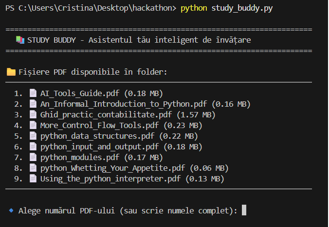
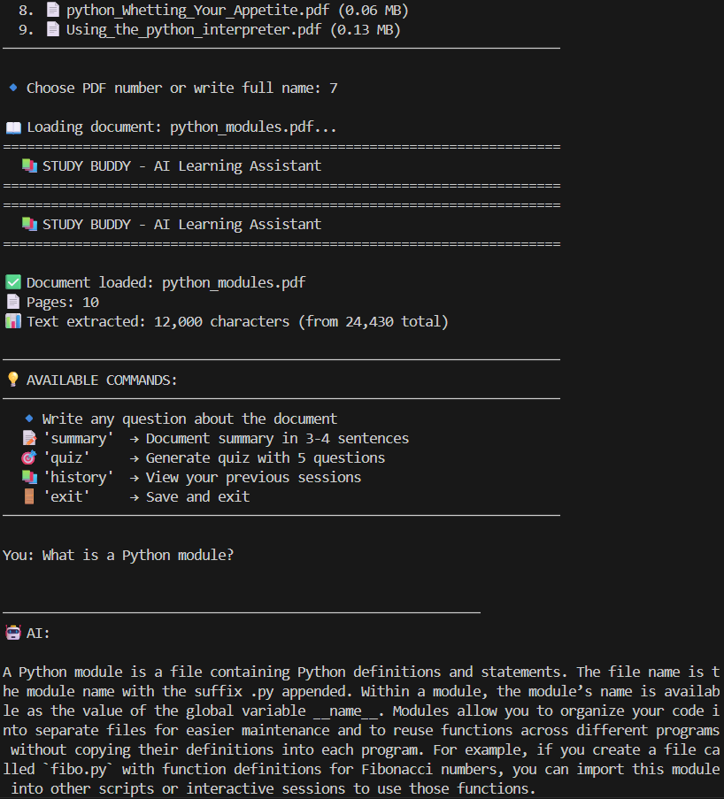
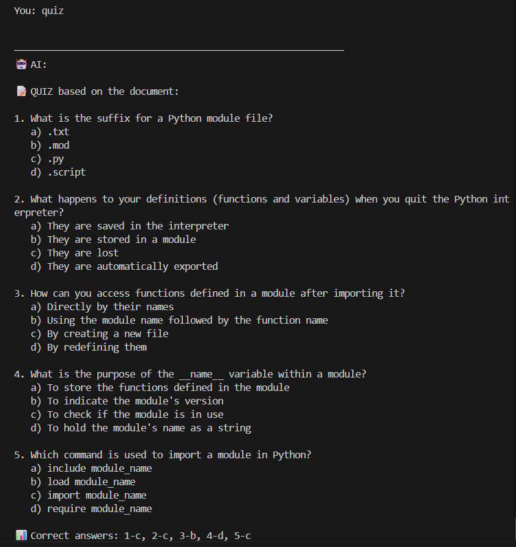

<div align="center">

# 📚 Study Buddy

### AI-Powered Learning Assistant for PDF Documents

[](https://www.python.org/downloads/)
[](https://azure.microsoft.com/products/ai-services/openai-service)
[](https://openai.com/index/gpt-4o-mini-advancing-cost-efficient-intelligence/)
[]()
[](https://opensource.org/licenses/MIT)

**Transform any PDF into an interactive learning experience**

[Features](#-features) • [Quick Start](#-quick-start) • [Usage](#-usage) • [Demo](#-demo)

---

</div>

## 🎯 What is Study Buddy?

Study Buddy is an **AI-powered learning assistant** that transforms static PDF documents into interactive study sessions. Upload any PDF (textbook, research paper, article) and have intelligent conversations about the content, generate custom quizzes, and get instant summaries.

### 🌟 Why Study Buddy?

- 🎓 **Study Smarter** - Ask questions and get instant, contextual answers
- 🎯 **Test Yourself** - Auto-generate quizzes to verify your understanding
- 💡 **Save Time** - Get document summaries in seconds
- 📊 **Track Progress** - All study sessions saved with statistics
- 🌍 **Multi-Language** - Supports Romanian and English responses

---

## ✨ Features

<table>
<tr>
<td width="50%">

### 🎓 Learning Features
- **📄 Multi-PDF Support** - Study any PDF document
- **💬 Smart Q&A** - Context-aware AI conversations
- **🎯 Quiz Generator** - Auto-create multiple-choice tests
- **📝 Smart Summaries** - Get concise overviews
- **🔍 Deep Understanding** - AI processes up to 12K chars

</td>
<td width="50%">

### 🎨 User Experience
- **🌈 Beautiful Interface** - Clean, emoji-rich UI
- **⚡ Fast Selection** - Choose PDFs by number or name
- **💾 Auto-Save** - Sessions saved automatically
- **📊 Study Stats** - Track questions & study time
- **🔄 Session History** - Review past conversations

</td>
</tr>
</table>

---

## 🎥 Demo

> ### 📸 Application Screenshots

<div align="center">

**PDF Selection Screen**



**AI Conversation**



**Quiz Generator**



</div>

### Example Session
```bash
## 🚀 Quick Start

### Prerequisites

Before you begin, ensure you have:

- ✅ Python 3.13 or higher
- ✅ Azure OpenAI Service account
- ✅ GPT-4o-mini deployment active
- ✅ Azure API key and endpoint

### Installation

#### 1️⃣ **Setup Project Folder**
```bash
cd Desktop
mkdir hackathon
cd hackathon
```

#### 2️⃣ **Install Dependencies**
```bash
python -m pip install openai pypdf
```

#### 3️⃣ **Download Study Buddy**

Place `study_buddy.py` in your `hackathon/` folder.

#### 4️⃣ **Configure Azure Credentials**

Open `study_buddy.py` and update **lines 8-11**:
```python
client = AzureOpenAI(
    api_key="YOUR-API-KEY-HERE",           # 🔑 Your Azure API key
    api_version="2024-08-01-preview",
    azure_endpoint="YOUR-ENDPOINT-HERE"    # 🌐 Your Azure endpoint
)
```

**💡 Where to find credentials:**
1. Go to [Azure AI Studio](https://oai.azure.com)
2. Click your deployment → "Keys and Endpoint"
3. Copy KEY 1 and Endpoint URL

**⚠️ SECURITY WARNING:**
- **NEVER** commit your actual API key to GitHub  
- **ALWAYS** use placeholder text like `YOUR-API-KEY-HERE` in public repositories  
- Keep your real credentials local only  
- For production apps, use environment variables or Azure Key Vault

#### 5️⃣ **Add PDF Documents**
```bash
# Place your PDF files in the hackathon/ folder
cp /path/to/your/document.pdf hackathon/
```

#### 6️⃣ **Run Study Buddy**
```bash
python study_buddy.py
```

🎉 **You're ready to learn!**

---

## 📖 Usage

### Available Commands

| Command | Description | Example |
|---------|-------------|---------|
| 🔹 **Type question** | Ask anything about the document | `What is inheritance?` |
| 📝 **`summary`** | Get 3-4 sentence document summary | Creates concise overview |
| 🎯 **`quiz`** | Generate 5-question multiple choice test | Includes correct answers |
| 📚 **`history`** | View all previous study sessions | Shows stats & timestamps |
| 🚪 **`exit`** | Save session and quit | Auto-saves before exit |

### Tips for Best Results

- ✅ **Ask specific questions** for detailed answers
- ✅ **Use `summary` first** to understand document structure
- ✅ **Generate `quiz`** to test comprehension
- ✅ **Review `history`** to track learning progress

---
## 🏗️ Technical Details

### Architecture
```
┌─────────────────┐
│   User Input    │
└────────┬────────┘
         │
    ┌────▼────┐
    │ PDF     │
    │ Reader  │──────┐
    └────┬────┘      │
         │           │
    ┌────▼────────┐  │
    │ Azure       │  │
    │ OpenAI      │◄─┘
    │ GPT-4o-mini │
    └────┬────────┘
         │
    ┌────▼────────┐
    │ JSON        │
    │ Storage     │
    └─────────────┘
```

### Built With

| Technology | Purpose |
|------------|---------|
| **Python 3.13** | Core language |
| **Azure OpenAI** | AI conversation engine |
| **GPT-4o-mini** | Fast, cost-effective model |
| **pypdf** | PDF text extraction |
| **JSON** | Session persistence |

### Key Specs

- **PDF Processing**: Up to 12,000 characters per document
- **Response Length**: Up to 2,000 tokens (~1,500 words)
- **Context Memory**: Full conversation history maintained
- **Cost**: ~$0.0001 per question (very affordable!)

---

## 🐛 Troubleshooting

<details>
<summary><b>❌ "Access denied" error</b></summary>

**Problem**: Invalid Azure credentials

**Solutions**:
1. Check API key is correct (no extra spaces)
2. Verify endpoint URL format: `https://your-resource.openai.azure.com/`
3. Ensure deployment name is `gpt-4o-mini`
4. Check Azure subscription is active

</details>

<details>
<summary><b>📄 PDF not detected</b></summary>

**Problem**: Study Buddy can't find your PDF

**Solutions**:
1. Verify PDF is in same folder as `study_buddy.py`
2. Check file has `.pdf` extension (lowercase)
3. Run `dir` (Windows) or `ls` (Mac/Linux) to confirm
4. Try moving PDF directly to hackathon folder

</details>

<details>
<summary><b>🤖 AI responses are cut off</b></summary>

**Problem**: Responses end abruptly

**Solution**: This is already fixed! `max_tokens` set to 2000.
- If still happening, increase on line ~175: `max_tokens=3000`

</details>

<details>
<summary><b>💬 "Nu găsesc informația" response</b></summary>

**Problem**: AI says it can't find information

**Solutions**:
1. Rephrase your question to be more specific
2. Try asking simpler questions first
3. Use `summary` to understand document scope
4. Check if PDF text extracted correctly (some PDFs are image-only)

</details>

<details>
<summary><b>💾 Sessions not saving</b></summary>

**Problem**: History is empty

**Solutions**:
1. Always use `exit` command (not Ctrl+C)
2. Check `study_sessions.json` exists in folder
3. Verify folder has write permissions
4. Check for error messages when exiting

</details>

---

## 📊 Project Stats

| Metric | Value |
|--------|-------|
| **Development Time** | 2 days (Weekend) |
| **Lines of Code** | ~400+ |
| **Azure Credits Used** | ~$2 / $200 |
| **Tests Passed** | 5/5 ✅ |
| **PDF Types Supported** | Text-based PDFs |
| **Languages** | Romanian + English |

---
## 🎓 Use Cases

### 👨‍🎓 Students
- Study for exams with AI-generated quizzes
- Get instant answers to textbook questions
- Create study notes from lecture PDFs

### 👩‍🔬 Researchers
- Analyze research papers quickly
- Extract key findings and methodologies
- Generate summaries for literature reviews

### 👨‍💼 Professionals
- Review technical documentation efficiently
- Learn new technologies from manuals
- Prepare for certifications with custom quizzes

### 🧑‍💻 Self-Learners
- Master programming concepts from tutorials
- Test comprehension with AI quizzes
- Track learning progress over time

---

## 🛣️ Roadmap

### ✅ Completed (Weekend 1)
- [x] PDF upload and processing
- [x] AI conversation with context memory
- [x] Quiz generation
- [x] Summary generation
- [x] Session history and stats
- [x] Multi-PDF support
- [x] Error handling

### 🔄 In Progress
- [x] README documentation
- [ ] Demo video (3 minutes)
- [ ] GitHub repository setup

### 🔮 Future Enhancements
- [ ] **Streamlit Web UI** - Beautiful web interface
- [ ] **Larger PDF Support** - Process 100+ page documents
- [ ] **Export Features** - Save notes to Markdown/PDF
- [ ] **Voice Input** - Ask questions by speaking
- [ ] **Spaced Repetition** - Smart quiz scheduling
- [ ] **Multi-Language UI** - Full interface translation
- [ ] **Cloud Storage** - Sync sessions across devices

---

## 🤝 Contributing

This is a hackathon project, but suggestions are welcome!

**Ways to contribute:**
- 🐛 Report bugs
- 💡 Suggest features
- 📖 Improve documentation
- 🧪 Add test cases

---

## 📄 License

This project is licensed under the **MIT License** - feel free to use, modify, and distribute.

---

## 🙏 Acknowledgments

- **Microsoft Azure** - For Azure OpenAI Service and $200 free credits
- **Anthropic Claude** - AI assistance during development
- **Python Community** - Excellent libraries (pypdf, openai)
- **Microsoft AI Dev Days** - Hackathon opportunity and learning platform

---

## 👤 Author

**Cristina**

🎯 **Hackathon**: Microsoft AI Dev Days 2025  
📅 **Development**: February 8-9, 2026 (Weekend 1)  
⚡ **Status**: Fully functional with quiz generation ✅  
🏆 **Achievement**: Built from zero Azure/AI knowledge to working product in 2 days

---

## 📞 Support & Contact

**Need help?**

1. 📖 Check [Troubleshooting](#-troubleshooting) section
2. 🔍 Review [Azure OpenAI Documentation](https://learn.microsoft.com/azure/ai-services/openai/)
3. 💬 Test with different PDF documents
4. 🔧 Verify all installation steps completed

---

<div align="center">

**Built with ❤️ using Azure OpenAI, Python, and determination**

⭐ **Star this repo if Study Buddy helped you learn!** ⭐

*Last Updated: February 12, 2026*

</div>